# Cassandra Watch - Architecture & Data Flow

## 🏗️ System Architecture Overview

Cassandra Watch is a real-time monitoring and management tool for Apache Cassandra clusters. It uses a **multi-layered architecture** with **real-time data streaming** to provide live insights into cluster performance and health.

## 📊 Sequence Diagram: Complete System Flow

```mermaid
sequenceDiagram
    participant User as 👤 User
    participant Frontend as 🖥️ Frontend (React)
    participant WebSocket as 🔌 WebSocket Context
    participant Backend as ⚙️ Backend (Node.js)
    participant JMX as 📊 JMX Service
    participant Cassandra as 🗄️ Cassandra Cluster
    participant SystemTables as 📋 System Tables

    Note over User, SystemTables: 1. INITIAL CONNECTION FLOW
    User->>Frontend: Open Application
    Frontend->>WebSocket: Initialize WebSocket Context
    WebSocket->>Backend: Establish WebSocket Connection
    Backend-->>WebSocket: Connection Established
    
    User->>Frontend: Enter Connection Details
    Frontend->>Backend: POST /api/connections/connect
    Backend->>Cassandra: Connect to Cluster
    Cassandra-->>Backend: Connection Success
    
    Note over User, SystemTables: 2. NODE DISCOVERY & JMX SETUP
    Backend->>SystemTables: Query system.peers & system.local
    SystemTables-->>Backend: Node Information
    Backend->>JMX: Initialize JMX Connections
    JMX->>Cassandra: Connect to JMX Ports (7199)
    Cassandra-->>JMX: JMX Connection Success
    
    Note over User, SystemTables: 3. INITIAL DATA LOADING
    Backend->>SystemTables: Fetch Cluster Metrics
    Backend->>JMX: Fetch Performance Metrics
    Backend->>WebSocket: Send Initial Data
    WebSocket->>Frontend: Update UI with Data
    
    Note over User, SystemTables: 4. REAL-TIME DATA STREAMING
    loop Every 2-5 seconds
        Backend->>SystemTables: Poll for Updates
        Backend->>JMX: Poll Performance Metrics
        Backend->>WebSocket: Broadcast Updates
        WebSocket->>Frontend: Update UI Components
    end
    
    Note over User, SystemTables: 5. USER INTERACTIONS
    User->>Frontend: Switch Tabs/Refresh
    Frontend->>WebSocket: Request Specific Data
    WebSocket->>Backend: Fetch Requested Data
    Backend-->>WebSocket: Return Data
    WebSocket->>Frontend: Update Specific Components
```



## 🔄 Detailed Data Flow Explanation

### **1. Initial Connection & Authentication**


**Why this step is crucial:**
- **Cluster Discovery**: Identifies all nodes in the cluster
- **Authentication**: Validates user credentials
- **Topology Mapping**: Creates a map of datacenters and racks
- **Connection Pooling**: Establishes connection pools for efficient querying

### **2. JMX Integration & Performance Monitoring**


**JMX MBeans being monitored:**
- **Memory Usage**: `java.lang:type=Memory`
- **Garbage Collection**: `java.lang:type=GarbageCollector`
- **Thread Pools**: `org.apache.cassandra.metrics:type=ThreadPools`
- **Cache Performance**: `org.apache.cassandra.metrics:type=Cache`
- **Compaction**: `org.apache.cassandra.metrics:type=Compaction`

### **3. WebSocket Real-Time Streaming**


**Why WebSocket is essential:**
- **Real-time Updates**: No polling required from frontend
- **Efficient Communication**: Single persistent connection
- **Bidirectional**: Frontend can request specific data
- **Reduced Latency**: Immediate data propagation
- **Resource Efficiency**: Less overhead than HTTP polling

### **4. Data Aggregation & Caching**


**Data Sources & Aggregation:**
- **System Tables**: Cluster topology, keyspace info, node status
- **JMX Metrics**: Performance counters, memory usage, thread pools
- **Operations API**: Real-time operation tracking
- **Caching Layer**: Reduces database load and improves response times

## 🎯 Why This Architecture Works

### **1. Separation of Concerns**
- **Frontend**: UI/UX and user interactions
- **Backend**: Data processing and business logic
- **JMX Service**: Performance monitoring
- **WebSocket Service**: Real-time communication

### **2. Scalability**
- **Connection Pooling**: Efficient database connections
- **Caching**: Reduces repeated queries
- **Modular Design**: Easy to extend and maintain
- **Load Distribution**: Backend handles heavy processing

### **3. Real-time Capabilities**
- **WebSocket Streaming**: Live data updates
- **JMX Integration**: Direct access to Cassandra metrics
- **Event-driven Updates**: Immediate UI refresh
- **Efficient Polling**: Backend manages update cycles

### **4. Reliability**
- **Error Handling**: Graceful degradation
- **Connection Recovery**: Automatic reconnection
- **Health Checks**: Continuous monitoring
- **Fallback Mechanisms**: Multiple data sources

## 🔧 Technical Implementation Details

### **Frontend Architecture**
```typescript
// WebSocket Context provides real-time data
const WebSocketContext = createContext<WebSocketContextType>({
  isConnected: boolean;
  metrics: AllMetrics | null;
  jmxData: any;
  connectJMX: () => Promise<void>;
  getJMXData: (forceRefresh?: boolean) => Promise<any>;
});
```

### **Backend Services**
```javascript
// WebSocket Service manages real-time updates
class WebSocketService {
  initialize(server) {
    this.wss = new WebSocket.Server({ server });
    this.startPeriodicUpdates();
  }
  
  startPeriodicUpdates() {
    setInterval(() => {
      this.broadcastMetricsUpdate();
    }, 2000); // Update every 2 seconds
  }
}
```

### **JMX Integration**
```javascript
// JMX Service connects to Cassandra nodes
class JMXService {
  async connectToNode(host, port = 7199) {
    const url = `service:jmx:rmi:///jndi/rmi://${host}:${port}/jmxrmi`;
    const connector = this.JMXConnectorFactory.newJMXConnector(url);
    return connector.connect();
  }
}
```

## 🚀 Performance Optimizations

### **1. Caching Strategy**
- **Metrics Cache**: 5-second TTL for JMX data
- **Connection Pooling**: Reuse database connections
- **WebSocket Broadcasting**: Single update to all clients

### **2. Update Frequency**
- **System Tables**: Every 5 seconds
- **JMX Metrics**: Every 2 seconds
- **UI Updates**: Real-time via WebSocket
- **Health Checks**: Every 30 seconds

### **3. Resource Management**
- **Connection Cleanup**: Automatic cleanup of stale connections
- **Memory Management**: Efficient data structures
- **Error Recovery**: Exponential backoff for failed connections

## 🔒 Security Considerations

### **1. Authentication**
- **Cassandra Authentication**: Username/password support
- **CORS Configuration**: Restricted origins
- **Rate Limiting**: Prevents abuse

### **2. Data Protection**
- **HTTPS Support**: Secure communication
- **Input Validation**: Sanitized user inputs
- **Error Handling**: No sensitive data exposure

This architecture ensures that Cassandra Watch provides **real-time, reliable, and scalable** monitoring for Apache Cassandra clusters while maintaining **excellent user experience** and **system performance**. 