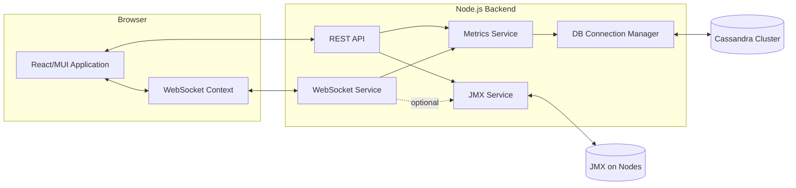
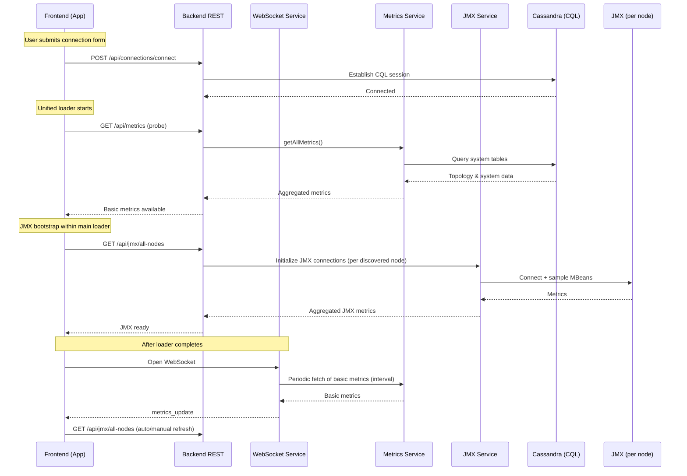
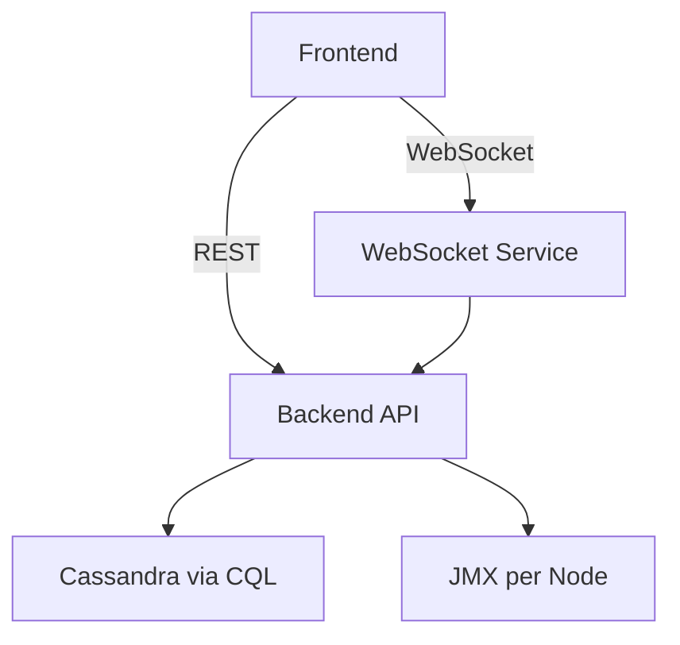
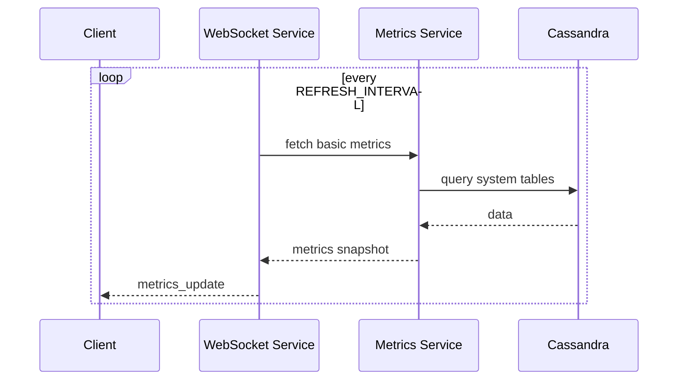

# Cassandra Watch

A production-ready monitoring and operations console for Apache Cassandra clusters. This document serves as a technical product requirements document (PRD) and implementation guide for the current system.

## 1. Problem Statement

Operating Cassandra at scale requires continuous visibility into cluster health, performance, and topology. Traditional approaches depend on ad-hoc tools (e.g., nodetool, custom scripts, JMX browsers) that fragment operational context, create blind spots, and delay response to incidents. Teams need a single console that:

- Connects securely to remote clusters without local nodetool access
- Surfaces near real-time performance and resource metrics
- Presents accurate cluster topology and system information
- Recovers gracefully from transient JMX/network issues
- Scales to multiple nodes and concurrent users

## 2. Goals and Non-Goals

Goals
- Provide a unified dashboard combining system table data and JMX metrics
- Establish a single, persistent JMX connection per session and reuse it across tabs
- Deliver continuous data updates without page reloads
- Offer operational actions through stable APIs
- Keep UX responsive: one unified loader during connection bootstrap, then non-blocking refreshes

Non-Goals
- Replacing full-featured APM or log analytics
- Acting as an administrative shell for arbitrary Cassandra commands

## 3. System Overview

The system consists of a React frontend, a Node.js backend, and data sources in the Cassandra cluster (CQL system tables and JMX MBeans). The backend exposes REST APIs and a WebSocket channel. The frontend maintains a single WebSocket session and a shared JMX connection context powering multiple pages.

### 3.1 Component Architecture

Notes
- REST API provides on-demand access to system tables and JMX-backed endpoints.
- WebSocket pushes periodic basic metrics and operations updates; JMX broadcast is intentionally disabled server-side to improve resilience. Frontend triggers JMX refreshes via API using a shared connection context.
- A persistent JMX state in the frontend context avoids reconnecting on tab switches.

### 3.2 Connection and Loader Flow

Rationale
- The loader blocks route rendering until CQL and initial JMX are ready, eliminating cascading loaders and page flicker.
- WebSocket drives lightweight, periodic updates for basic metrics; JMX refresh remains API-driven to isolate transient JMX instability from the socket channel.

## 4. Data Sources and Semantics

System Tables (CQL)
- Topology: `system.local`, `system.peers`
- Schema: `system_schema.keyspaces`, `system_schema.tables`
- Storage estimates: `system.size_estimates`
- Compaction history: `system.compaction_history`

JMX MBeans (per node)
- Memory: `java.lang:type=Memory`
- Garbage collection: `java.lang:type=GarbageCollector,*`
- Thread pools: `org.apache.cassandra.metrics:type=ThreadPools,*`
- Cache: `org.apache.cassandra.metrics:type=Cache,*`
- Compaction: `org.apache.cassandra.metrics:type=Compaction,*`

Aggregation
- Frontend aggregates node-level JMX to cluster-level totals/percentiles for the Dashboard.
- Performance page uses shared JMX context; numbers update without reestablishing connections.

## 5. Interfaces

### 5.1 REST Endpoints (selected)

- GET /api/metrics
  - Returns cluster, nodes, keyspaces, storage, system, basic performance metrics (no JMX).
- GET /api/metrics/nodes
  - Returns discovered nodes with addresses and datacenter/rack info.
- GET /api/metrics/keyspaces
  - Returns keyspace list and replication metadata.
- GET /api/metrics/keyspaces/:keyspace/tables
  - Returns table metadata for a keyspace.
- GET /api/jmx/all-nodes
  - Returns aggregated JMX metrics across nodes.
- POST /api/jmx/force-disconnect
  - Forces all JMX connections to close and clears caches.
- GET /api/jmx/health/:host
  - Health probe for a node’s JMX connectivity.
- POST /api/connections/connect
  - Establishes CQL connectivity using provided cluster configuration.

### 5.2 WebSocket Protocol

Message types
- initial: initial payload including basic metrics and operations
- metrics_update: periodic basic metric snapshot
- operations_update: active operation set
- connection_pending, error: control/diagnostic messages

Subscriptions
- Clients can subscribe to logical channels (e.g., "metrics", "operations"). JMX broadcasting is disabled by design; clients fetch JMX via REST.

## 6. Frontend Architecture

State and Data Flow
- A `WebSocketContext` maintains the socket connection, basic metrics, operations, and JMX state.
- `connectJMX()` and `getJMXData(forceRefresh)` in the context coordinate JMX initialization and refresh with exponential backoff and error recovery.
- Pages read from shared context; no component opens its own JMX session. This avoids per-tab reconnects and loaders.

Rendering Discipline
- `App.tsx` gates route rendering on a single unified loader that completes only after CQL and initial JMX data are ready. Individual pages avoid redundant loaders.
- Auto-refresh for JMX is opt-in and respects the shared state; numbers update without layout shift.

## 7. Backend Architecture

Metrics Service
- Encapsulates system-table queries, aggregation, and basic performance derivation.
- Provides `getBasicMetrics()` (used by WebSocket) and `getAllMetrics()` for initial readiness checks.

JMX Service
- Manages per-node JMX connections, sampling, and caching.
- Implements cleanup of stale connections and forced disconnect for recovery flows.

WebSocket Service
- Maintains client set and subscriptions.
- Periodically fetches and broadcasts basic metrics and operations.
- JMX broadcasting is disabled; avoids coupling socket health to JMX availability.

## 8. Error Handling and Recovery

- JMX timeouts trigger exponential backoff in the frontend context; users can force a reset via the UI which calls `POST /api/jmx/force-disconnect`.
- Backend periodically cleans up stale JMX connections.
- Database connection loss downgrades WebSocket messages to `connection_pending` until reconnected.
- All APIs return structured errors without leaking sensitive details.

## 9. Performance Characteristics

- Backend polling interval (WebSocket basic metrics): 5 seconds by default (configurable).
- JMX sampling cadence: driven by frontend refresh cadence; cached to limit per-node load.
- Cassandra driver timeouts are tuned for remote clusters; heartbeats maintain session liveness.
- Aggregations avoid N+1 calls by batching CQL reads and by caching JMX samples per interval.

## 10. Security Considerations

- CORS is restricted to the configured frontend origin.
- No local nodetool dependency; all data sourced via CQL and JMX over the network.
- Environment variables control credentials and hosts; secrets are not logged.
- Optional SSH tunnel mode (when enabled) can route JMX through bastion hosts.

## 11. Deployment and Operations

Local development
- Backend: `npm run dev` in `backend/`
- Frontend: `npm start` in `frontend/`
- Monorepo helper: `npm run dev` at root runs both concurrently

Docker Compose
- `docker-compose.yml` defines `cassandra-watch-backend`, `cassandra-watch-frontend`, and optional `cassandra` and `redis` services.
- Environment variables:
  - Backend: `PORT`, `CASSANDRA_HOSTS`, `CASSANDRA_PORT`, `CASSANDRA_DC`, `CASSANDRA_USERNAME`, `CASSANDRA_PASSWORD`, `REFRESH_INTERVAL`, `CORS_ORIGIN`
  - Frontend: `REACT_APP_API_URL`

Kubernetes (guidance)
- Run backend and frontend as separate deployments and services.
- Configure readiness/liveness probes: backend `/health`, frontend `/health` (nginx location).
- Externalize configuration via ConfigMaps/Secrets.

## 12. Product Requirements Checklist

Functional
- Single unified loader that completes after CQL and JMX readiness
- Persistent JMX connection shared across pages
- Silent, periodic updates without layout shifts
- Accurate cluster topology and storage information from system tables
- Manual and auto JMX refresh with backoff and recovery

Non-Functional
- Resilience to intermittent JMX failures without impacting WebSocket
- No local nodetool dependency; remote cluster friendly
- Type-safe frontend with clear null/edge-case guards
- Observability: structured errors, health endpoints

## 13. Future Enhancements

- Optional server-side JMX broadcasting on a dedicated channel with throttling and circuit breakers
- Node-level historical metrics with compact time-series storage
- Role-based access control and audit logging
- Pluggable data source adapters (e.g., Prometheus exporters) to blend with existing telemetry

## 14. Appendix: Diagrams

### 14.1 High-Level Architecture

### 14.2 Update Cycle

---

This document describes the intent, architecture, and current implementation of Cassandra Watch. It should be read as a living specification; implementation details may evolve while preserving the goals and guarantees outlined above. 